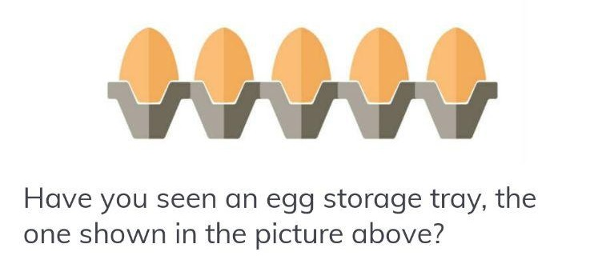

# A Hundred Eggs: A Mini Tutorial for Java
 :egg: :egg: :egg: :egg: :egg: :egg: :egg: :egg: :egg: :egg: :egg: :egg: :egg: :egg: :egg: :egg: :egg: :egg: :egg: :egg: :egg: :egg: :egg: :egg: :egg: :egg: :egg: :egg: :egg: :egg: :egg: :egg: :egg: :egg: :egg: :egg: :egg: :egg: :egg: :egg: 

## A Java Mini Tutorial for
1. Array (and how to transform it into stream),
2. OO, Class and Status,
3. Use of Exception, and
4. Stream & Functional Interface: Supplier, Consumer, Predicate.

Get inspired by a picture:  

:egg: :egg: :egg: :egg: :egg: :egg: :egg: :egg: :egg: :egg: :egg: :egg: :egg: :egg: :egg: :egg: :egg: :egg: :egg: :egg: :egg: :egg: :egg: :egg: :egg: :egg: :egg: :egg: :egg: :egg: :egg: :egg: :egg: :egg: :egg: :egg: :egg: :egg: :egg: :egg: 