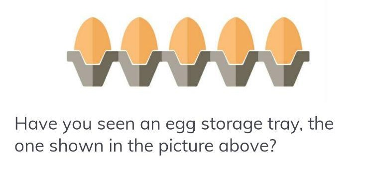

# A Hundred Eggs: A Mini Tutorial for Java
:egg: :egg: :egg: :egg: :egg: :egg: :egg: :egg: :egg: :egg: :egg: :egg: :egg: :egg: :egg: :egg: :egg: :egg: :egg: :egg: :egg: :egg: :egg: :egg: :egg: :egg: :egg: :egg: :egg: :egg: :egg: :egg: :egg: :egg: :egg: :egg: 

from: https://blog.muspoe.info/2020/04/java.html

__A Java Mini Tutorial for:__
1. Array & Collection/List,
2. OO, Class and Status,
3. Use of Exceptions, and
4. Stream & Functional Interfaces: Supplier, Consumer, Predicate.

### package list:
* ```.article``` - Simplified version for article.
* ```._list``` - Collection/List version.
* ```.array``` - Array version.
* ```.ex``` - Exceptions (shared).


Get inspired by a picture: <br>



:egg: :egg: :egg: :egg: :egg: :egg: :egg: :egg: :egg: :egg: :egg: :egg: :egg: :egg: :egg: :egg: :egg: :egg: :egg: :egg: :egg: :egg: :egg: :egg: :egg: :egg: :egg: :egg: :egg: :egg: :egg: :egg: :egg: :egg: :egg: :egg: 

